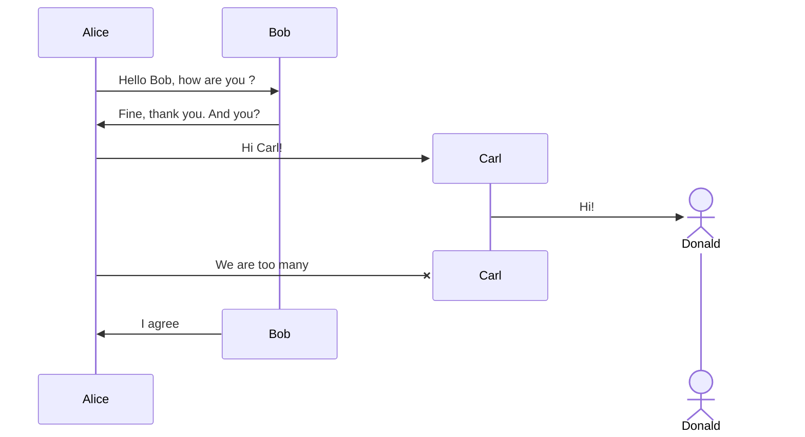

# 综合技术知识文档

## 1. 引言

在现代软件开发中，掌握多种编程语言和工具是非常重要的。本文档将介绍 SQL、JavaScript、TypeScript、Vue 和 Java 等技术，并通过代码示例展示它们的使用方法。同时，还会使用 Mermaid 来绘制流程图。

## 2. SQL 代码示例

### 2.1 创建数据库和表

```sql
-- 创建一个名为 testdb 的数据库
CREATE DATABASE testdb;

-- 使用 testdb 数据库
USE testdb;

-- 创建一个名为 users 的表
CREATE TABLE users (
    id INT AUTO_INCREMENT PRIMARY KEY,
    name VARCHAR(50) NOT NULL,
    email VARCHAR(100) UNIQUE NOT NULL,
    age INT
);
```

### 2.2 插入数据

```sql
-- 向 users 表中插入一条数据
INSERT INTO users (name, email, age)
VALUES ('John Doe', 'john.doe@example.com', 30);
```

### 2.3 查询数据

```sql
-- 查询所有用户
SELECT * FROM users;

-- 查询年龄大于 25 岁的用户
SELECT * FROM users WHERE age > 25;
```

## 3. JavaScript 代码示例

### 3.1 函数定义和调用

```javascript
// 定义一个函数，用于计算两个数的和
function add(a, b) {
  return a + b
}

// 调用函数
const result = add(2, 3)
console.log(result) // 输出: 5
```

### 3.2 数组操作

```javascript
// 创建一个数组
const numbers = [1, 2, 3, 4, 5]

// 使用 map 方法将数组中的每个元素乘以 2
const doubledNumbers = numbers.map((num) => num * 2)
console.log(doubledNumbers) // 输出: [2, 4, 6, 8, 10]
```

## 4. TypeScript 代码示例

### 4.1 接口和类的使用

```typescript
// 定义一个接口
interface Person {
  name: string
  age: number
}

// 定义一个类，实现 Person 接口
class Employee implements Person {
  constructor(public name: string, public age: number, public department: string) {}

  introduce() {
    console.log(`My name is ${this.name}, I'm ${this.age} years old and work in ${this.department}.`)
  }
}

// 创建一个 Employee 实例
const employee = new Employee('Jane Smith', 28, 'HR')
employee.introduce() // 输出: My name is Jane Smith, I'm 28 years old and work in HR.
```

### 4.2 泛型函数

```typescript
// 定义一个泛型函数，用于交换两个变量的值
function swap<T>(a: T, b: T): [T, T] {
  return [b, a]
}

// 调用泛型函数
const [x, y] = swap(10, 20)
console.log(x, y) // 输出: 20 10
```

## 5. Vue 代码示例

### 5.1 简单的 Vue 组件

```vue
<template>
  <div>
    <h1>{{ message }}</h1>
    <button @click="changeMessage">Change Message</button>
  </div>
</template>

<script>
export default {
  data() {
    return {
      message: 'Hello, Vue!',
    }
  },
  methods: {
    changeMessage() {
      this.message = 'Message changed!'
    },
  },
}
</script>
```

## 6. Java 代码示例

### 6.1 类和对象的使用

```java
// 定义一个类
class Rectangle {
    private double length;
    private double width;

    // 构造函数
    public Rectangle(double length, double width) {
        this.length = length;
        this.width = width;
    }

    // 计算面积的方法
    public double getArea() {
        return length * width;
    }
}

// 主类
public class Main {
    public static void main(String[] args) {
        // 创建一个 Rectangle 对象
        Rectangle rectangle = new Rectangle(5, 3);
        // 调用 getArea 方法
        double area = rectangle.getArea();
        System.out.println("The area of the rectangle is: " + area);
    }
}
```

## 7. Mermaid 流程图示例



## 8. 总结

通过本文档的示例，我们展示了 SQL、JavaScript、TypeScript、Vue 和 Java 等技术的基本用法，以及如何使用 Mermaid 绘制流程图。这些技术在不同的场景中都有广泛的应用，希望对大家有所帮助。
